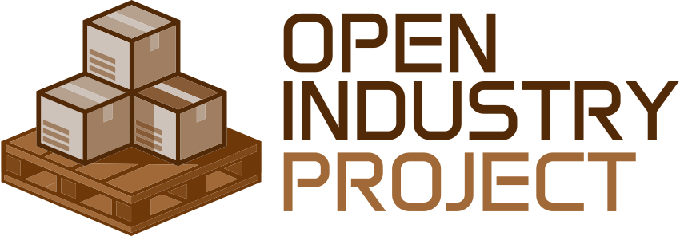

<picture>
  <source media="(prefers-color-scheme: dark)" srcset=".github/OIP-LOGO-RGB_HORIZONTAL-INV.svg">
  <source media="(prefers-color-scheme: light)" srcset=".github/OIP-LOGO-RGB_HORIZONTAL.svg">
  
</picture>

Free and open-source warehouse/manufacturing development framework and simulator built with [open62541](https://github.com/open62541/open62541), [libplctag](https://github.com/libplctag/libplctag), and [Godot](https://github.com/godotengine).

The goal is to provide an open framework to create software and simulations using industrial equipment/devices and for people to be able to test their ideas or simply educate themselves while using standard industrial platforms.

Supported Communication Protocols:

- OPC UA via open62541
- Ethernet/IP via libplctag
- Modbus TCP via libplctag
- Siemens S7 1200 & 1500 Put/Get protocol

## Table of Contents

- [Demo](#demo)
- [Getting Started](#getting-started)
  - [Installation](#installation)
  - [Creating Your First Simulation](#creating-your-first-simulation)
- [Communications](#communications)
  - [OPC UA Browser](#opc-ua-browser)
  - [Tag Name Format](#tag-name-format)
- [Importing Models](#importing-models)
- [Help Wanted](#help-wanted)
- [License](#license)

## Demo

https://github.com/Open-Industry-Project/Open-Industry-Project/assets/105675984/e78c3b0a-bb8e-411a-aa17-b2b6534868a4

## Getting Started

### Installation

1. Download the latest package from the [Releases](https://github.com/Open-Industry-Project/Open-Industry-Project/releases) page. It includes the project files and the custom Godot fork.
2. Extract the archive and open the included Godot editor.
3. Use the Project Manager to open or create a new project.

### Creating Your First Simulation

All objects used in a simulation scene will be in the Parts tab.

A simulation can be created by adding a new scene and selecting "New Simulation".

This creates a new scene with the top node labelled "Simulation":

Parts can be dragged into the viewport to instantiate them. Once they're in the scene they can be modified.

https://github.com/user-attachments/assets/217c93cd-0b2d-46b8-a333-32be3417f019

Most parts have properties that can be configured to communicate with a PLC or OPC UA server (see [Communications](#communications)). In this example Ignition was used as an OPC server to write to the conveyor tag.

https://github.com/user-attachments/assets/6d72a15b-b1ff-4402-b7d5-1f1a3fbeb085

## Communications

Configure communication with PLCs or an OPC UA server via the "Comms" panel at the bottom of the editor:

The simulator will not communicate with any device until the "Enable Comms" checkbox is checked.

Tag Groups are a logical way to organize sets of tags. Each Tag Group is associated with one PLC or one OPC UA client. When connecting to multiple PLCs or OPC UA endpoints, create a separate tag group for each one.

The "Polling Rate" indicates how often OIPComms will read all the tags that are part of that tag group. The simulation does not read directly from the devices; it reads from a thread-safe data buffer that holds the value retained from the last poll. Writing values from the simulation occurs as soon as possible and is also thread-safe.

In the event that a write operation is queued by the simulation and a poll is halfway through completing (for example 100 out of 200 tags in the group have been read), the write operation will not complete until the poll completes.

The "Gateway" is the IP address of the target controller, and the path is typically the rack/slot location of the PLC. The "CPU" dropdown contains the following options:

The Protocol dropdown provides four options:

- `ab_eip` — Ethernet/IP communication via the libplctag library
- `modbus_tcp` — Modbus TCP communication via the libplctag library
- `opc_ua` — OPC UA communication via the open62541 library
- `siemens put/get` — S7 communication 

When changing the Protocol to `opc_ua`, the options change to reflect the connection parameters for an OPC UA endpoint. The "Endpoint" is the OPC UA protocol address which includes the IP address and port of the server.

Devices typically have these settings: Enable Comms, Tag Group, and Tag Name (Diffuse Sensor shown).

### OPC UA Browser

When using the `opc_ua` protocol, you can browse the server's address space directly from the editor using the built-in OPC UA Browser. To open it, select an OPC UA tag group and click `Browse` in the Comms panel. The browser dock will connect to the configured endpoint and display the server's node tree.

Expanding a node loads its children on demand, and selecting a node displays its details, including the NodeId, data type, current value, access level, and description. Use the **Copy Node ID** button to copy a node's ID to the clipboard for use as a tag name in your simulation parts.

### Tag Name Format

The Tag Name format depends on the protocol selected for the tag group:

- **EtherNet/IP (`ab_eip`)**: The CIP tag name as defined in the PLC program, e.g. `MyTag`, `Program:MainProgram.MyTag`, `myUDT.field`, `myArray[0]`.
- **Modbus TCP (`modbus_tcp`)**: A register type prefix followed by the register number. Prefixes: `co` (coil), `di` (discrete input), `hr` (holding register), `ir` (input register). For example: `hr0`, `co21`, `ir64000`.
- **OPC UA (`opc_ua`)**: The full NodeId. For example, `ns=2;s=MyVariable` or `ns=2;i=12345`.
- **Siemens S7 (`s7`)**: Register identifier `Ix.y, Qx.y, Mx.y` (coil), `IBx, QBx, MB.x` (byte), `IWx, MDx, QLx, ...` (word, double word, and non standard L notation quad word). The Input memory space can be written if they do not overlap the rack & Profinet inputs. The Output space can be written also under the same condition.

The communication API ([OIPComms](https://github.com/Open-Industry-Project/oip-comms)) is contained within a separate GDExtension plugin. Instructions to build and update it are located in its own repository.

## Importing Models

Although this project includes several models, you may be interested in adding more. Here are some resources:

- [3dfindit](https://www.3dfindit.com/en/) — large library of free industrial CAD models
- Most manufacturers also provide CAD files directly on their own websites

It is recommended to export the files in their native format (usually STEP), modify them if needed in any CAD software, and then export as FBX for additional work in Blender or to be imported straight into Godot.

For details on supported 3D formats and import settings, see the [Godot documentation on importing 3D scenes](https://docs.godotengine.org/en/stable/tutorials/assets_pipeline/importing_3d_scenes/index.html).

## Help Wanted

Contributions are welcome! Check the [open issues](https://github.com/Open-Industry-Project/Open-Industry-Project/issues) for tasks to pick up, or help with any of the following:

- Additional equipment and device models
- Improved error/exception handling
- Code review and refactoring
- Documentation and tutorials

Join us on [Discord](https://discord.gg/ACRPr6sBpH) to discuss ideas or ask questions.

## License

This project is licensed under the [MIT License](LICENSE).
